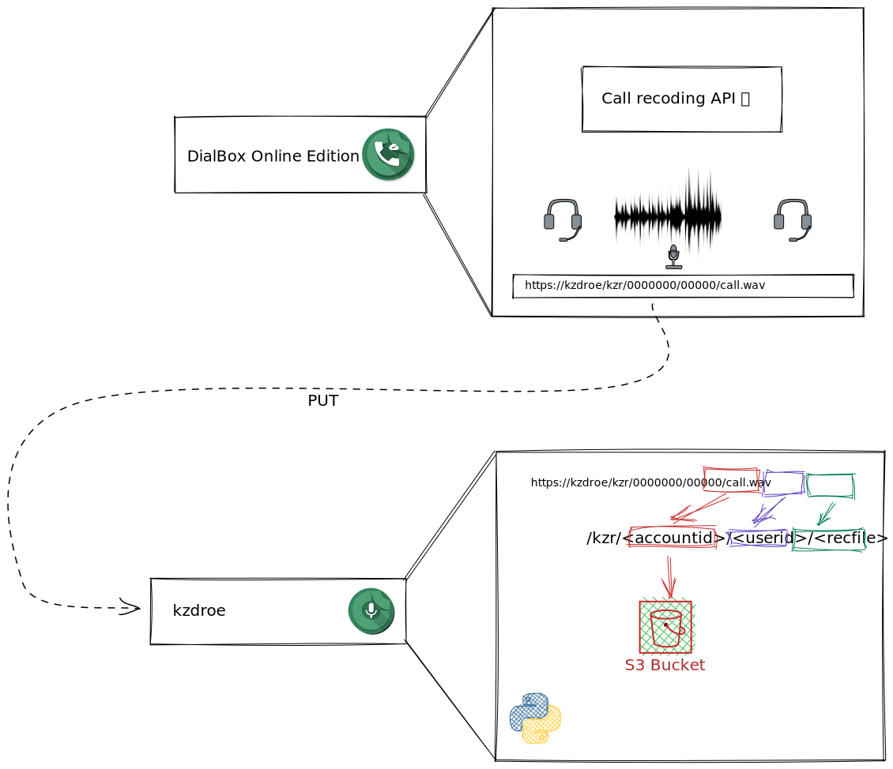

# kzdroe

Here is a simple Python Flask for receiving a recording from doe.dialbox.cloud.



# Build And Push to docker registry

``` Bash
docker build -t sapian/kzdroe:0.2.1 -t sapian/kzdroe:latest -t us.gcr.io/sapiancomco-1531131691088/sapian/kzdroe:0.2.1 .
```

# Run For Testing

## Set Enviroment variables
Fill de file `.env`

``` ini
LOG_LEVEL=INFO
```

## Run

``` Bash
docker run --env-file .env --rm -it sapian/kzdroe:latest
```
